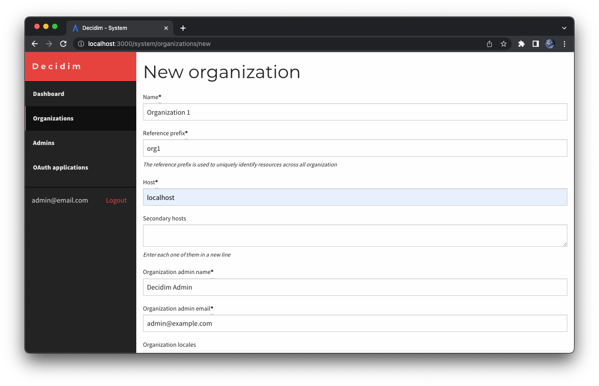
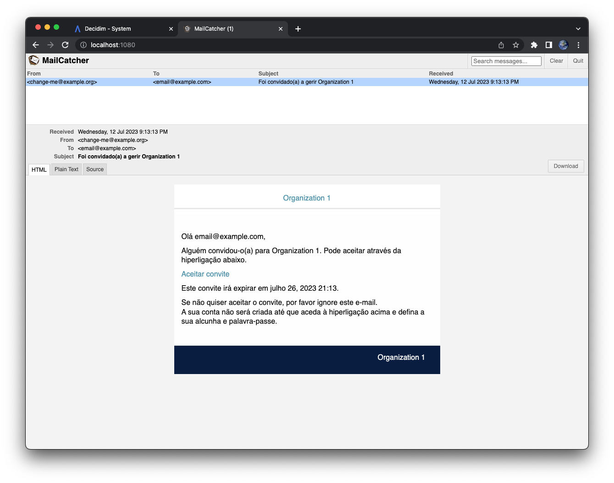

# Plataforma Brasil Participativo - Um país com a cara do povo

Brasil Participativo é a nova plataforma digital do governo federal, um espaço para que a população possa contribuir com a criação e melhoria das políticas públicas. 

A plataforma Brasil Participativo é uma instância adaptada e customizada do software livre  [Decidim](https://github.com/decidim/decidim). No espaço administrador da plataforma, podemos criar diversos espaços de participação democrátrica que seja transparente, aberto e totalmente auditável.


# Como surgiu a plataforma

A Plataforma é uma parceria da Secretaria de Participação Digital, e foi desenvolvida com o apoio da Dataprev, da Universidade de Brasilia (UnB) da comunidade Decidim-Brasil. Essa versão é uma evolução do fork do projeto desenvolvido pela [Nomade](https://gitlab.com/nomadetec/decide).

O Laboratório Avançado de Pesquisa e Desenvolvimento de Software (LAPPIS) da Faculdade UnB Gama (FGA) estabeleceu um método que facilita a participação de alunos do curso de engenharia de software em projetos cívicos de software livre como instrumento pedagógico. Coordenado por professores com experiência na participação de comunidades, desenvolvimento de softwares livres e métodos ágeis, foi o parceiro de desenvolvimento de projetos importantes do governo federal como o Portal do Software Público, Participa.br, Aplicativo da Conferência da Juventude e Dialoga Brasil.

Todos esses projetos foram evoluções do projeto de Software Livre Noosfero, um projeto brasileiro desenvolvido em Ruby on Rails, pela [Colivre](https://pt.wikipedia.org/wiki/Noosfero). Essa nova parceria entre a Secretaria Nacional de Participação Social e o Lappis para o desenvolvimento da plataforma Brasil Participativo, dá continuidade a esse histórico de participação digital no Brasil utilizando software livre. O Objetivo dessa parceria é a consolidação de Laboratório de Inovação para Participação com capacidade de desenvolver e implementar estratégias e ferramentas de participação digital que possam ser (re)utilizadas pelos demais órgãos do governo.

Democracia participativa de código aberto, participação cidadã e governo aberto para cidades e organizações

Este é o repositório de código aberto para o decide, baseado no [Decidim](https://github.com/decidim/decidim).


# Getting Started

## Configurando a aplicação via Docker

### Configurando e Subindo o ambiente   o ambiente pela primeira vez

Para subir o ambiente corretamente são necessarias as seguintes ferramentas:

* Docker
* Docker Compose

### Instalando o Docker e o Docker Compose

* Para instalar o Docker, recomenda-se seguir o tutorial oficial disponível [aqui](https://docs.docker.com/engine/install/ubuntu/).
* Após instalar o Docker, também é recomendado seguir os passos pós-instalação disponíveis [aqui](https://docs.docker.com/engine/install/linux-postinstall/).
* Feita a instalação do Docker e as configurações pós-instalação, instale o plugin _compose_ seguindo o tutorial oficial disponível [aqui](https://docs.docker.com/compose/install/linux/).

### Executando serviços
O ambiente do projeto depende de 4 containers especificados no arquivo `docker-compose.yml`.
O projeto está configurado para ser executado automaticamente via `docker compose` à partir do comando:
```
docker compose up
```
Quando executado pela primeira vez, o sistema faz o donwload das imagens dos containers e configura o ambiente automaticamente à partir do arquivo `.env.dev.`. 

> **Obs**.: Estes containers foram configurados somente para ambiente de desenvolvimento e, por enquanto, não devem ser utilizados em ambiente de produção.


Após todos os serviços serem iniciados, a aplicação Decidim estará disponível pelo endereço `localhost:3000`.Além disso, há um serviço do `mailcatcher` que auxilia na captura de e-mails para testes de validação de contas de usuário disponível pelo endereço `localhost:1080`.

Ao finalizar a configuração do ambiente, o script `start.sh` é executado automaticamente onde o banco postgres é criado e configurado (pelos comandos `rake db:create` e `rake db:migrate`). Por fim, um `seed` é executado contendo a conta de administrador do sistema, cujas credenciais estão definidas no arquivo de ambiente `.env.dev` conforme o exemplo abaixo:

```
ADMIN_EMAIL=admin@email.com
ADMIN_PASSWORD=admin
```

### Acessando a aplicação

Depois de acessar a URL `localhost:3000/system`, aparecerá na tela uma área de login. Forneça a senha e o e-mail utilizado na criação do usuário _admin_.


### Preenchendo cadastro inicial de organização

No primeiro _login_ você será direcionado para uma página para criar a primeira organização dentro da aplicação.

* No campo _Name_ preencha o nome da organização que você deseja criar. Por exemplo: `Organization 1`
* No campo _Reference prefix_ preencha o prefixo de identificacao da organização em minúsculo. Por exemplo `org1`
* No campo _Host_ preencha com o domínio que será utilizado na URL da organização. Nesse caso, preencha com `localhost`
* No campo _Secondary host_ não é necessário preencher nada.
* No campo _Organization admin name_ preencha o nome do administrador da organização. Por exemplo: `Decidim Admin`
* No campo _Organization admin email_  preencha o e-mail que será utilizado pelo administrador da organização. Por exemplo: `admin@example.com`
* Na seção _Organization locales_  selecione quais os idiomas estarão habilitados na organização, e a linguagem padrão. Por exemplo: `enabled: English, Português`, `default: Português`
* No campo _User registration mode_ selecione a opção `allow participants to register and login`
* Na seção _available authorizations_ selecione todos as opções.

Clique em `Create organization & invite admin`




### Acessando a organização com _admin_

Depois de finalizar o cadastro da organização, abra o _mailcatcher_ no navegador acessando o endereço `http://localhost:1080`. Clique no e-mail enviado, e no conteúdo do e-mail clique em `Aceitar convite`.



---

Ao clicar na confirmação do e-mail, será aberta uma página para finalizar a criação do admin da organização.

* Preencha o _nickname_ com o apelido do administrador da organização. Por exemplo: `admin`
* Preencha os campos de senha com uma senha forte. Por exemplo: `dBzJR2TVF4Ns&Wf&VashYqU#gG8^TC!B4sb$BiNS` <small>(Não discuta, apenas copie e cole essa senha :clown:)</small>
* Marque os check-boxes e depois clique em `Salvar`
* No modal amarelo que aparece na tela, clique em `Reveja-os agora`.
* Em seguida clique em `I agree with the terms`

---


## Configurando a aplicação

Caso você queira um tutorial passo a passo, fizemos um bem detalhado na [wiki do repositório](https://gitlab.com/lappis-unb/decidimbr/decidim-govbr/-/wikis/home).

Se não aqui vão as especificações gerais para subir o projeto em ambiente dev. Você precisará seguir algumas etapas antes de fazer com que o aplicativo funcione corretamente:

1. Abra um console Rails no servidor:  `bundle exec rails console`
1. Crie um usuário administrador do sistema:

```ruby
user = Decidim::System::Admin.new(email: <email>, password: <password>, password_confirmation: <password>)
user.save!
```

1. Visite `<your app url>/system`  e faça login com suas credenciais de administrador do sistema
1. Crie uma nova organização. Marque os idiomas que deseja usar para essa organização e selecione um idioma padrão.
Defina o host padrão correto para a organização, caso contrário, o aplicativo não funcionará corretamente. Observe que você precisa incluir qualquer subdomínio que possa estar usando.

1. Preencha o restante do formulário e envie.

Agora você está pronto!


## Subindo o Sidekiq e o Mailcatcher

Duas ferramentas serão necessárias durante a utilização do ambiente de desenvolvimento: o *sidekiq* e o *mailcatcher*. O *sidekiq* é uma gem ruby que fornece um mecanismo de processamento de jobs ou tarefas em segundo plano.

Suba o mailcatcher com o comando

```
mailcatcher
docker compose up -d
foreman start
```

Em seguida, suba o *sidekiq* com o comando:

```bash
bundle exec sidekiq
```

Depois de acessar a URL `localhost:3000/system`, aparecerá na tela uma área de login. Forneça a senha e o e-mail utilizado na criação do usuário _admin_.

##  Criando espaços de participação digital

Se você quiser testar os módulos da plataforma, criando espaços participativos e seus componentes participativos, estamos documentando alguns tutoriais na nossa [wiki](https://gitlab.com/groups/lappis-unb/decidimbr/-/wikis/Documentação).

# Como testar a plataforma?

O ambiente de produção do projeto pode ser acessado [aqui](https://brasilparticipativo.presidencia.gov.br).

O ambiente de lab/dev   pode ser acessado [aqui](https://lab-decide.dataprev.gov.br).

Para criar usuário no ambiente dev, entrar em contato com algum dos mantenedores da plataforma.

# Contribuindo para o projeto


Achou interessante o projeto? Ta querendo aprender Ruby on Rails? Quer conhecer brasileiros que contribuem para software livre?

Tem várias ``Good first issues`` pensadas em facilitar sua primeira contribuição. 

Leia nosso [Guia de Contribuição](CONTRIBUTING.md) para aprender sobre nosso processo de desenvolvimento, como propor correções de bugs e melhorias, e como construir e testar suas alterações na Plataforma Brasil Participativo.


No nosso [Guia de Contribuição] tem o passo a passo em como iniciar sua contribuição na comunidade

Acreditamos firmemente que a diversidade de pessoas contribuindo para um projeto é fundamental para garantir a qualidade do software. Com o objetivo de desenvolver uma plataforma de participação digital acessível a todos os brasileiros, reconhecemos a importância de um cuidadoso processo de desenvolvimento do software, buscando envolver a maior diversidade possível de colaboradores.

Para alcançar esse objetivo, valorizamos a criação de um ambiente de colaboração acolhedor e seguro. Nesse sentido, implementamos um [código de conduta], que é rigorosamente aplicado. Através desse código, esperamos estabelecer uma comunidade de software livre que promova desafios técnicos estimulantes, ofereça mentoring de qualidade e faça com que todos se sintam pertencentes e valorizados.

Nosso código de conduta é essencial para garantir que todos os colaboradores tenham uma experiência positiva, livre de discriminação, assédio ou qualquer forma de comportamento prejudicial. Ao adotar esses princípios, podemos fomentar uma cultura inclusiva que celebra a diversidade de ideias, perspectivas e origens.

Estamos comprometidos em criar um ambiente colaborativo onde todos possam contribuir com seus conhecimentos e habilidades, independentemente de sua identidade, gênero, orientação sexual, etnia, religião ou qualquer outra característica individual. Através desse engajamento diversificado, temos a certeza de que seremos capazes de desenvolver um software de alta qualidade que atenda às necessidades e expectativas de todos os brasileiros.

Contamos com você para fazer parte dessa comunidade inclusiva e construir uma plataforma de participação digital verdadeiramente acessível e abrangente. 


# Contribuidores

Essa plataforma não seria possível se não fosse por esses herois! Além de toda comunidade Decidim

# Licença
